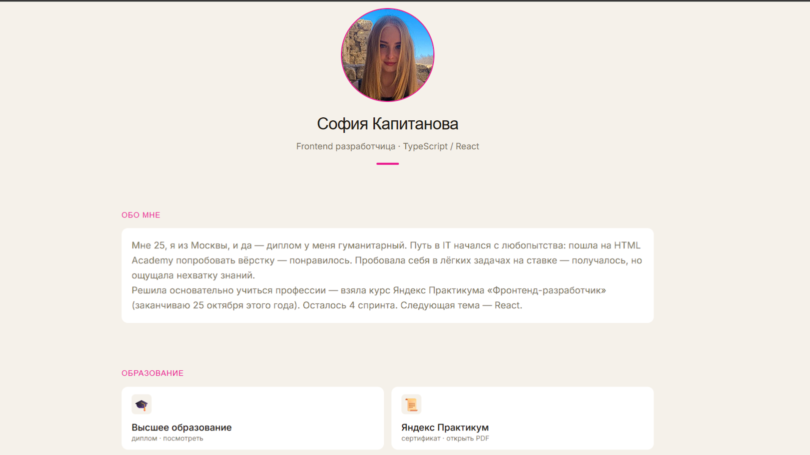

# Личный сайт-визитка

Одностраничный адаптивный сайт-портфолио на чистом JavaScript, без фреймворков. Светлая и тёмная тема, интерактивная секция с проектами, модальные окна для документов и превью работ.

## 🛠 Стек

- **HTML5 / CSS3** — семантичная вёрстка, CSS-переменные, `clamp()` для резиновой типографики и размеров
- **JavaScript (ES6+)** — модули, без сторонних библиотек
- **Vite** — сборщик и dev-сервер
- **Prettier + ESLint** — форматирование и статический анализ кода

## ✨ Функциональность

- Переключение светлой/тёмной темы с плавной анимацией
- Секция проектов: раскрытие по клику, модальное окно с описанием и навигацией стрелками (десктоп), карточки с описанием сразу видны на мобильной версии
- Модальные окна для документов об образовании (диплом, сертификат) с зумом и блокировкой скролла страницы
- Полностью адаптивная вёрстка (desktop-first, брейкпоинт 768px)
- Доступность: `aria-label`, `aria-hidden`, `role="dialog"`, семантическая структура

## 📁 Структура проекта

\```
src/
├── main.js # точка входа
├── styles/ # переменные, темы, база
├── components/ # компоненты, каждый со своими стилями и логикой
│ ├── header/
│ ├── hero/
│ ├── education/
│ ├── projects/
│ ├── contacts/
│ └── footer/
└── data/
└── projects.js # данные о проектах
\```

## 🚀 Запуск проекта

\```bash

# установить зависимости

npm install

# запустить dev-сервер

npm run dev

# собрать production-версию

npm run build

# отформатировать код

npm run format

# проверить код линтером

npm run lint
\```

## 📸 Превью



## 👩‍💻 Автор

**София Капитанова**
Frontend-разработчица, учусь в Яндекс Практикуме

- [Telegram](https://t.me/Sofik000000)
- [GitHub](https://github.com/Sofia-Kapitanova)
- [hh.ru](https://hh.ru/resume/b1410140ff09a1784c0039ed1f363157317a49)
- [Сетка](https://setka.ru/users/019d29dc-91cc-71b3-a1f9-9ae14f9ffefc)
